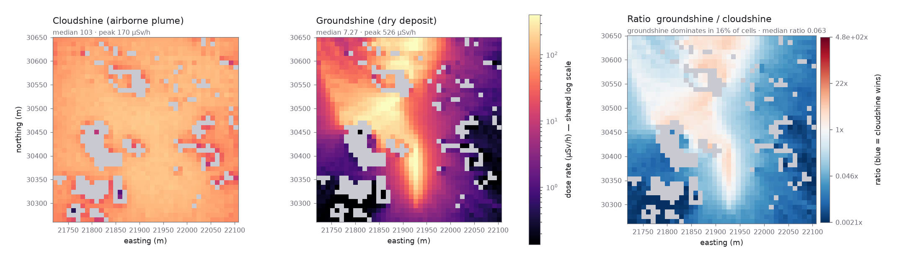

# Stage 10: OpenMC — from particle tracks to a dose map

This is the last stage of the pipeline: turn Fluent's raw particle trajectories
(Stage 9) into an actual radiological dose rate map, in µSv/h, over real ground. It's a
condensed, presentation-style adaptation of [`dose/NOTES.md`](../../dose/NOTES.md) and
[`dose/README.md`](../../dose/README.md) — those two files are the full run log and design
rationale; this page is the concise version that gets the core idea across, plus the math
behind it.

## What OpenMC is doing here, in one sentence

OpenMC is a Monte Carlo **photon transport** code: it simulates individual gamma photons
being emitted, travelling through a 3D geometry, interacting with matter (scattering,
absorption), and being "tallied" — counted, with a physical weighting — wherever a
detector-like region is defined. Radionuclide dose is exactly this problem: a plume of
radioactive material sitting in the air (or deposited on the ground) is emitting real
gamma photons in every direction, and the question is how much dose a person standing at
some real (x, y) location on the ground actually receives per hour.

The geometry OpenMC ray-traces against is the same watertight STL from Stage 8, converted
to DAGMC's `.h5m` format (`stl_to_h5m.py`) — DAGMC (Direct Accelerated Geometry Monte
Carlo) lets OpenMC test "which side of this triangulated surface am I on" directly against
the mesh, instead of needing the geometry rebuilt as CSG primitives (boxes, cylinders,
etc.) the way traditional Monte Carlo codes require.

## Chapter 0: two physics ideas this all rests on

**Attenuation and mean free path.** A beam of photons passing through matter is absorbed/
scattered exponentially with distance:

```
N(x) = N0 · e^(-μx)         μ = linear attenuation coefficient [1/cm]
```

The **mean free path** `λ = 1/μ` is the average distance a photon travels before its first
interaction. This one number governs almost everything about how "local" a radiation
source looks. Measured for this project's actual nuclide (Cs-137, 661.7 keV) in air:
**λ ≈ 106.5 m**. The whole domain here is only ~400m across — under 4 mean free paths — so
a receptor anywhere in the domain is within "sight" (radiologically speaking) of most of
the airborne plume, not just the air immediately around it. That single number is why the
cloudshine map below looks almost flat across the whole domain, while the groundshine map
(deposited material, effectively a 2D surface source) looks sharply peaked near the real
plume centreline: attenuation in air over hundreds of metres barely discriminates near
from far, but a surface deposit's own footprint is small enough that distance really does
matter.

**Point-kernel dose, and how this project checked itself against it.** For a simple
isotropic point source of strength `S` [photons/s] in a uniform medium, the dose rate at
range `r` has a closed form:

```
D(r) = (S / 4πr²) · e^(-μr) · DCF
```

`4πr²` is just the inverse-square spreading of the source over a sphere; `e^(-μr)` is the
attenuation above; `DCF` is a dose conversion factor (photon fluence → dose rate, see
below). This project actually built a source buried deep in a slab of concrete
(~300 mean free paths, `μ_concrete` ≈ 1/6.8cm at 1 MeV) and compared OpenMC's own answer
against this formula: **19.22 µSv/h from OpenMC vs. 19.33 µSv/h analytic — 0.6%
agreement.** That single check validates the whole chain at once: source normalization,
the dose-coefficient application, the unit conversion, and the geometry/ray-tracing all
have to be right simultaneously to land that close.

## From residence time to a source term (the actual coupling)

Stage 9's particle tracks give positions and times, not concentrations or activities.
Turning "a tracer spent 3.2 seconds crossing this cell" into "this cell contains this many
becquerels" is a mass-balance argument, not a measurement — and it's the single most
important piece of physics reasoning in this whole stage, so it's worth deriving properly
rather than just stating the formula.

### The steady-state derivation

Model the entire plume as one well-mixed reservoir (a "compartment"), with material going
in at the release rate `Q` [Bq/s] and leaving at a rate proportional to how much is
currently inside, divided by how long material typically stays (`τ`, the mean residence
time):

```
dN/dt = Q  -  N/τ            N = total activity in the domain [Bq]
```

This is the same equation as a bathtub with the tap running at rate `Q` and draining at a
rate proportional to how full it is. At **steady state**, the tub stops rising —
`dN/dt = 0` — and solving gives:

```
N* = Q · τ
```

The inventory sitting in the domain, once things have settled down, is just the release
rate times how long each parcel typically stays. This is *exactly* what the code computes,
just estimated by Monte Carlo instead of solved analytically: each of the `N_tracks` equal-
weight tracers contributes `Σ dt` (its total lifetime, summed over every logged step), so

```
τ̄  =  (1/N_tracks) · Σ_tracks Σ_steps dt        (the Monte-Carlo estimate of τ)
N* =  Q · τ̄                                     (steady-state inventory, in Bq)
```

and the same sum, binned by *where* each step happened rather than collapsed into one
number, gives the steady-state activity **field**:

```
activity in cell i  =  (Q / N_tracks) · Σ_(steps landing in cell i) dt     [Bq]
concentration_i     =  activity_i / cell_volume_i                          [Bq/m³]
```

This is the exact code in `run_dose.py::source_strengths()` — no resampling or
interpolation needed, because Fluent already wrote one point per cell crossing (Stage 9),
so `dt` between two consecutive points genuinely *is* time spent in one cell.

The photon emission rate follows directly:

```
photons/s = N* · yield = (Q · τ̄) · yield
```

Worked with this pipeline's own real numbers (Kent Ridge cloudshine run): `Q = 10¹² Bq/s`,
`τ̄ = 91.4s` → `N* = 9.14×10¹³ Bq` → `photons/s = N* × 0.851 = 7.78×10¹³`. `N*` sits
**91.4× above `Q`**, which is just `τ̄` itself — the mean residence time is the conversion
factor between a release rate and the standing inventory it produces.

### Steady state vs. transient — what's actually being assumed, and why it's a reasonable model here

**Steady state** means the release rate `Q` has been constant for long enough that the
inventory has stopped changing (`dN/dt = 0`) — the plume has fully "filled up" to its
equilibrium shape and dose looking at any moment looks the same as at any other moment,
provided the release keeps going at the same rate. This is the assumption this whole
pipeline makes: Fluent's flow field is itself a converged steady RANS solution (no time
dependence at all), and the dose map answers "what is the dose rate once things have
settled into equilibrium," not "what is the dose rate 30 seconds into an accident."

**Transient** means `Q` isn't constant, or not enough time has passed for the plume to
reach equilibrium — the release just started, is ramping up/down, or is a short "puff"
rather than a continuous stream. The same compartment equation, without assuming
`dN/dt = 0`, has the general solution (a standard first-order linear ODE, solved by an
integrating factor):

```
dN/dt = Q(t) - N/τ
N(t)  = e^(-t/τ) · ∫₀ᵗ Q(t') · e^(t'/τ) dt'            (Duhamel's formula)
```

For the simplest transient case — a constant release `Q` switched on at `t = 0` into an
initially empty domain — this integrates to:

```
N(t) = Q·τ·(1 - e^(-t/τ))
```

which starts at 0 and rises toward exactly the steady-state answer `N* = Q·τ` as
`t → ∞` — the steady-state formula is just the `t → ∞` limit of the transient one, not a
different model. This is a genuinely useful sanity check: it says the steady-state
approximation used throughout this pipeline is good once `t ≫ τ` (a few mean residence
times after the release starts), and specifically *not* good for the first few τ of a real
accident, which is exactly when an emergency response would care most.

### Why the code is already close to able to do this — for the future, not attempted yet

`read_particle_tracks.py` already parses each track's own `Particle Time` for every
logged point — the raw ingredient for a transient calculation is already present in every
run this pipeline has done, it's just been collapsed by summing every step's `dt`
regardless of *when* it happened. A time-resolved version needs only one real change: bin
each step into **(space cell, time window)** instead of **(space cell)** alone —

```
for each step (cell_i, t_step, dt):
    time_window = floor(t_step / window_size)
    accumulate dt into strengths[time_window][cell_i]     # was: strengths[cell_i]
```

— producing a *sequence* of source-strength meshes instead of one, each fed through the
same OpenMC settings/geometry/tally machinery already built (a separate `fixed source`
run per time window, or, more efficiently, reusing one run with a time-tagged source if a
future OpenMC feature supports it directly). For a genuinely time-varying release rate
`Q(t)`, each window's photons/s would need the Duhamel-weighted inventory above rather
than the plain steady-state `Q·τ̄`, but the *spatial* binning logic — the actual expensive
part of this pipeline, and the part validated against DAGMC and the analytic point-kernel
check — carries over completely unchanged. This is a real, scoped, not-yet-built
extension, not a hypothetical rewrite.

## From a source field to a dose number: the Monte Carlo tally chain

Once OpenMC has the source (above) and the geometry (Stage 8's STL via DAGMC), it runs the
actual Monte Carlo transport: sample a photon's starting cell (weighted by that cell's
share of total source strength), sample its direction (isotropic) and energy (monoenergetic
661.7 keV for Cs-137), then track it through the geometry, sampling real interaction
physics (photoelectric absorption, Compton scattering, pair production) using the real
photon cross-section data for concrete and air, until it's absorbed or leaves the domain.
Repeat for millions of photons ("particles" in OpenMC's settings — the batches/particles
counts control Monte Carlo statistical precision, where relative error on a tally falls
roughly as `1/√N` for `N` simulated histories — more particles buys a tighter number, at
linear compute cost).

Each tally cell accumulates a **track-length estimate** of photon flux weighted by an
ICRP-116 dose coefficient (energy- and geometry-dependent, `AP` = antero-posterior
irradiation geometry, appropriate for a standing person facing the source), then the whole
chain of unit conversions is:

```
tally          [pSv·cm²]  ×  [particle·cm / src]     =  pSv·cm³ / src
÷ cell_volume  [cm³]                                 =  pSv / src
×  photons_per_s          [photon/s]                 =  pSv / s
×  3600 / 1e6                                        =  µSv / h
```

— i.e. the dose-coefficient-weighted flux tally (a per-source-particle quantity OpenMC
reports) gets rescaled by the real photon emission rate computed above, then unit-converted
from pico-Sievert-per-second to the more usable micro-Sievert-per-hour.

Because the real terrain is not flat (Stage 4 — ground here runs from 20m to ~60m across
the domain), the tally is a full 3D column stack rather than one flat slab at a fixed
elevation, and `read_dose.py` picks, per (x,y) column, the tally bin nearest the real local
ground height plus a receptor height (1.5m, a standing person) — a flat-slab tally would
otherwise report the dose *inside solid rock* over most of a sloped domain.

## Cloudshine vs. groundshine — same machinery, different source term

Two dose contributions, both run through the identical geometry/tally/reader code, only
the *source* differing:

- **Cloudshine**: source = the airborne residence-time field above, directly from Fluent's
  tracks (physically, a noble gas or a non-depositing aerosol — walls are set to
  `reflect` in Fluent, so tracers bounce rather than stick).
- **Groundshine**: the plume is *not* tracked depositing in Fluent at all — deposition is
  computed afterward, in post-processing, as `flux = v_d · C_air` (a deposition velocity
  times the near-ground air concentration already computed for cloudshine), accumulated
  over a release duration into a surface activity, then re-run through OpenMC as a 2D
  ground-surface source instead of a 3D volume source.



This is a real OpenMC output from this pipeline (Kent Ridge domain, Cs-137, 10¹²Bq/s
release). Cloudshine (left) is genuinely close to flat — median 103, peak 170 µSv/h, a
factor of ~1.7 — exactly consistent with the "under 4 mean free paths, everyone sees most
of the plume" reasoning above. Groundshine (middle) is sharply peaked along the real
plume centreline — median 7.27, peak 526 µSv/h, over **70× range** — because a surface
deposit is a genuinely local, near-field source, not a domain-filling one. The ratio panel
(right) shows groundshine actually *dominates* total dose in about 16% of cells (near the
plume's ground track) despite cloudshine having the larger domain-wide median — a real,
physically meaningful result, not an artifact: the two contributions matter in different
places for different reasons; a real dose assessment needs both, not just whichever is
larger on average.

## What's validated vs. what's assumed (stated plainly, not hidden)

**Validated against something external, not just self-consistent:** the 0.6% analytic
point-kernel check above; DAGMC's own `check_watertight`/`overlap_check` reporting a clean
geometry; a source buried deep in the terrain slab leaking exactly **0.00000** (confirms
material assignment and ray-tracing topology together); the 0.096% deposited-fraction
result independently supporting the "non-depleting airborne field" assumption used to
justify computing deposition in post rather than in Fluent.

**Assumed, stated rather than hidden:** Cs-137, monoenergetic; dry deposition only, ground
only (no roofs/walls); no decay, weathering, or resuspension; `reflect` walls (exactly
correct for a noble gas, an approximation for an aerosol); steady RANS (see the transient
discussion above for what that specifically means and doesn't mean).

## Files in this folder

- `dose_compare.png` — real cloudshine/groundshine/ratio output, copied from
  `data/openmc_data/dose_compare.png` (produced by `dose/compare_dose.py`), not
  regenerated for this README.
