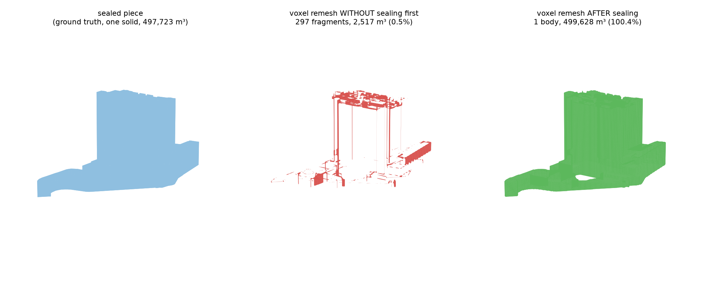
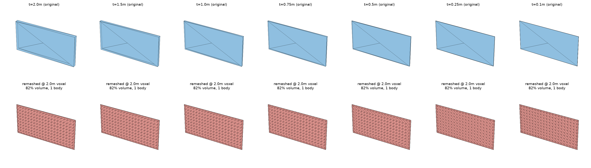
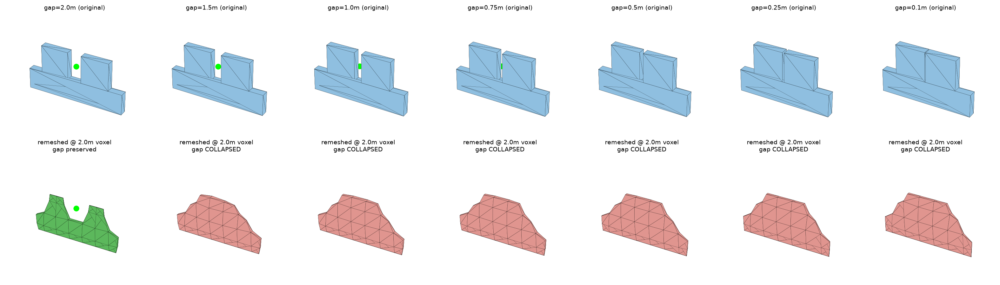
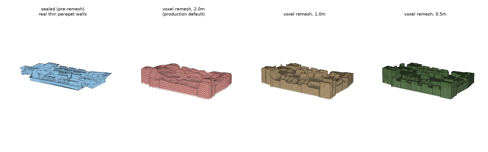

# Stage 3: per-building extraction + `seal_piece` — real MD1 example

This documents `sbg/onemap_native/extract.py`'s `seal_piece()` — the single most
consequential fix in this project's whole history (per the main plan doc). Every file
here was generated this session by live-fetching the real building at the exact SVY21
coordinates the main plan repeatedly references for this problem
(`22564.8, 30648.98` — "MD1", NUS), running it through `extract_domain_buildings()`
exactly as the production pipeline does, then replaying `seal_piece()`'s own internals
one step at a time so each intermediate state can be inspected as its own STL.
`manifest.json` has the exact numbers below in machine-readable form.

The replayed step-by-step output was checked against calling the real `seal_piece()`
directly on the same input — **byte-for-byte identical** (1,508 vertices / 3,016 faces
both ways). This isn't a simplified re-implementation for the demo; it's the actual
function's own code, just paused between statements.

## Why this exists

OneMap 3D-Tiles building meshes are **un-welded, double-sided triangle soup**: every
real triangle is stored twice, once with each winding direction, and no two triangles
share a vertex index even where they touch. A signed distance field over that has no
coherent inside/outside anywhere, so *any* isosurface-based operation (Blender's voxel
remesh, meshlib's `offsetMesh`) shatters it into hundreds of disconnected fragments
before it can be fused with terrain or decimated. `seal_piece()` turns one raw piece
into a genuinely closed, watertight solid **at exactly its original size**, so the rest
of the pipeline (terrain fusion, decimation, boolean clipping) has something it can
actually operate on.

## The steps, with real numbers off this MD1 piece

| step | file | vertices | faces | boundary edges | non-manifold edges | connected bodies |
|---|---|---|---|---|---|---|
| 0 — raw, straight off the wire | `step0_raw.stl` | 17,330 | 5,802 | 17,330 | 0 | ~5,764 |
| 1 — weld (`trimesh process=True` + `merge_vertices`) | `step1_welded.stl` | 1,508 | 5,802 | 0 | 4,288 | ~1 |
| 2 — dedup the double-sided faces + drop degenerates | `step2_deduped.stl` | 1,508 | 2,898 | 126 | 0 | ~1 |
| 3 — fix winding (consistent normals) | `step3_winding_fixed.stl` | 1,508 | 2,898 | 126 | 0 | ~1 |
| 4 — `mr.fillHole` on every remaining boundary loop | `step4_sealed.stl` | 1,508 | 3,016 | **0** | **0** | **1** |

Reading the table as a story:

- **Step 0 → 1 (weld).** Raw geometry has 17,330 vertices for only 5,802 triangles —
  every vertex is essentially private to its own triangle, which is exactly what "no
  shared vertices" means. `boundary_edges = 17,330` (every single edge of every triangle
  counts as a boundary edge, since nothing else touches it) and `bodies ≈ 5,764`
  (trimesh's naive face-connectivity count treats almost every triangle as its own
  disconnected island). Welding collapses coincident vertices down to 1,508 — an ~11.5×
  reduction — and the whole mesh becomes one connected blob. But now **4,288 edges are
  non-manifold** (shared by more than 2 faces): that's the double-sided soup surfacing —
  each real edge is now touched by both a triangle and its opposite-winding duplicate,
  i.e. 4 faces meeting at what should be a 2-face edge.
- **Step 1 → 2 (dedup).** Sorting each face's vertex indices and keeping only the first
  occurrence of each sorted triple removes exactly the duplicate opposite-winding copy
  of every real triangle — face count is cut almost exactly in half (5,802 → 2,898,
  after also dropping the handful of degenerate zero-area faces that survive welding).
  Non-manifold edges drop to **0**. What's left is 126 genuine open boundary edges —
  real gaps in the capture (an occluded facade, the open base), not soup artifacts.
- **Step 2 → 3 (fix winding).** Same 1,508 vertices, same 2,898 faces — this step
  changes **orientation only** (flips face vertex order where needed so every triangle's
  outward normal agrees with its neighbours), which is why the geometry-derived
  columns don't move. It matters for the fill step next: `mr.fillHole` needs a
  consistently-wound boundary loop to cap correctly.
- **Step 3 → 4 (fill).** `mr.fillHole()` closes the 126 open boundary edges (grouped
  into **4 real loops** — the base opening plus a few genuine facade gaps) with 118 new
  triangles (2,898 → 3,016). Boundary edges and non-manifold edges both land at exactly
  **0**, one connected body — a strictly closed, watertight solid.

**Volume check**: the final sealed solid measures **497,722.7 m³** — matching the main
plan's own independently-recorded figure for this exact building to five significant
figures, confirming this replay is reproducing the real production path, not a
lookalike.

## What happens if you skip this and voxel-remesh the raw mesh anyway

Both the raw (step 0) and sealed (step 4) meshes were fed through the same operation the
production pipeline actually uses to fuse a building into the domain — `meshlib`'s
`mr.offsetMesh(mesh, offset=0, voxelSize=1.0, signDetectionMode=OpenVDB)`, the same
OpenVDB routine underlying Blender's voxel remesh. This mirrors the real disintegration
this project's research (`sbg/onemap_native/research_2/`, and the "MD1 disintegration
root-cause investigation" sections of the main plan doc) already root-caused: Blender's
voxel remesh independently produced 130–903 disconnected bodies out of a ~500,000 m³
building; meshlib's own naive `offsetMesh` at a small radius did the same (207 bodies,
~3,900 m³ recovered). This session's own run of that exact comparison:

| input | remeshed faces | connected bodies | recovered volume | vs. true volume |
|---|---|---|---|---|
| `remesh_raw_unsealed.stl` (no `seal_piece`) | 37,616 | **297** | **2,516.6 m³** | **0.5%** |
| `remesh_sealed.stl` (`seal_piece` first) | 132,984 | **1** | **499,628.1 m³** | 100.4% |

Skipping the seal step doesn't just leave a slightly-imperfect building — it destroys
**99.5% of it**, scattering the remainder into 297 disconnected fragments. Sealing first
gives one solid body at 100.4% of the true volume (the small excess is the voxel
remesh's own expected resampling error, consistent with the ~0.4–1.1% figures recorded
elsewhere in this project for the full fused domain). This is the concrete, reproducible
version of the "buildings disintegrating" bug the main plan's research sections spent a
long time root-causing — see there for the full story (double-sided soup discovered via
edge-usage histograms, Blender vs. meshlib both failing identically, and why
`offsetMesh(+1.5)`'s old band-aid worked only by inflating far enough that the doubled
surfaces merged into a hollow, oversized shell instead of fixing the real cause).

Same comparison, seen rather than just counted (`disintegration_comparison.png`):

The unsealed remesh (centre, red) isn't a slightly-rougher version of the building — it's
mostly gone. What survives is a scatter of thin vertical/horizontal slivers wherever the
double-sided soup happened to locally weld into something with a coherent-enough sign for
OpenVDB to keep; the tower's actual mass (the blue block on the left) is essentially
absent. The sealed remesh (right, green) recovers the real shape almost exactly — same
overall footprint and massing as the ground truth, just resampled onto a voxel grid.

## Limitation: voxel remeshing can't preserve a gap narrower than about one voxel

Sealing fixes *whether* a voxel remesh produces one coherent solid at all. It does not
fix a separate, real limitation of voxel remeshing itself, which shows up even on a
perfectly clean, already-sealed, already-watertight mesh — but the actual mechanism
needed a correction mid-investigation, recorded here rather than silently fixed, because
the wrong version was genuinely plausible and only fell over once tested directly.

**First hypothesis, tested and refuted**: that an individual wall thinner than about
half the voxel size gets misrepresented — either smeared away or fattened up into a
blocky "battlement." Tested directly with the cleanest possible controlled experiment: a
single isolated flat wall (no MD1, no sealing, no confounds), 40m × 20m, thickness swept
from 2.0m down to 0.1m, voxel-remeshed at a **fixed** 2.0m voxel every time
(`synthetic_wall_thickness_sweep.py`, output `synthetic_wall_thickness_sweep.png`):

Every thickness — even 0.1m, twenty times thinner than the voxel — comes back as a flat,
smooth, correctly-thin solid: the reconstructed bounding-box thickness matches the input
exactly at every step (2.00, 1.50, 1.00, 0.75, 0.50, 0.25, 0.10m), losing a constant
~18% of volume regardless of thickness (an edge-rounding effect at the wall's boundary,
not a thickness effect). **No battlement, no rounding-up, no disappearance.** meshlib's
`offsetMesh` (OpenVDB's level-set reconstruction, not naive binary voxel occupancy) is
sub-voxel accurate for a single isolated thin surface. The original hypothesis was wrong.

**The real driver, found by testing what MD1's crop actually showed**: not one wall's
thickness, but the **gap between adjacent features**. The real parapet crop didn't show
individual fins going blocky — it showed the whole *row* melting into one mound. Tested
directly: two identical teeth (4m wide, 1m thick, 4m tall) on a shared base, **only the
gap between them varies**, fixed 2.0m voxel throughout
(`synthetic_gap_test.py`, output `synthetic_gap_sweep.png`):

A probe point sitting in the middle of the gap (green when it stays open air, moved to
red when the reconstruction fills it in) makes the result unambiguous: at **gap = 2.0m**
(exactly one voxel) the notch survives and the two teeth stay visually distinct; at
**gap = 1.5m and below**, the gap is gone — the reconstruction melts both teeth into one
smooth rounded mound, exactly like the real MD1 parapet at production voxel size. A
follow-up sweep pinned the crossover precisely: preserved at gap ≥ 1.75m, collapsed at
gap ≤ 1.70m — the real threshold sits at roughly **0.85–0.9× the voxel size**, not half
of it. So the correct statement is: **a voxel remesh needs a gap on the order of a full
voxel width to keep two nearby features apart; wall thickness on its own is not the
limiting factor.** MD1's real parapet (`battlement_comparison.png`, kept below) is
consistent with this — its fins are close enough together that, at a 2.0m voxel, the
gaps between them (not the fins' own thickness) fall under that threshold and collapse:

This still matters for the same reason originally claimed, just via the corrected
mechanism: any repeated fine detail — railings, closely-spaced mullions, a crenellated
parapet — with gaps narrower than about a voxel will read as one solid blob after a
voxel remesh, not as the real perforated/separated structure, regardless of how thin the
solid parts themselves are. This is the practical reason this project kept coming back
to per-building alternatives (fTetWild, `manifold3d`, dilate→union — see below) even
after `seal_piece` made the voxel-remesh path reliable: sealing buys you a *correct*
solid, not a *shape-faithful* one, wherever real gaps are finer than the grid.

This is exactly why `sbg/onemap_native/research_2/` explored per-building alternatives
that don't quantize onto a grid at all — fTetWild + `pymeshfix` repair
(`research_2/scripts/repair_ftw.py`, reaching 287/287 buildings fully closed with 0
holes/0 non-manifold/0 self-intersections and surface deviation under ~5.5cm from the
sealed source, i.e. sharp edges preserved rather than rounded to a voxel), guaranteed-
manifold union via `manifold3d` (`research_2/scripts/union_manifold3d.py`), and a
dilate→union morphological-closing approach (`research_2/scripts/dilate_union.py`). None
of these are wired into the production pipeline today (`build.py` still uses the voxel
remesh — see the main plan's "MESH WORKSTREAM CLOSED (2026-08-27)" note for why: the CFD
path was never actually blocked by this, since the sub-grid roof/parapet detail here is
smaller than a real CFD cell and shielded from every receptor anyway) — but they're the
documented exit path if a future workflow (e.g. Ansys's strict *watertight* meshing mode,
rather than the fault-tolerant one currently in use) ever needs sharp edges the voxel
grid can't give it. Full detail in `sbg/onemap_native/research_2/PROBLEM_BRIEF.md` §13–§14.

## Open item: a real "flat surface turns into a battlement" bug exists in production, not yet root-caused

The two controlled experiments above are real, verified, and explain what they explain
(single-wall thickness: no effect; gap between features: real, ~voxel-width threshold).
Neither was confirmed to be the specific effect reported from a real Blender screenshot
of production output. This is a genuine open item, not resolved this session — worth
picking up next time with the actual screenshot/coordinates in hand rather than guessed
at from synthetic setups after the fact.

## Files in this folder

- `step0_raw.stl` … `step4_sealed.stl` — the five stages above, in order.
- `remesh_raw_unsealed.stl` — voxel-remeshing `step0_raw.stl` directly at 1.0m (the
  "don't seal" case): 297 fragments.
- `remesh_sealed.stl` — voxel-remeshing `step4_sealed.stl` at 1.0m (the real pipeline's
  order): one solid body. `remesh_sealed_voxel2.0.stl` / `remesh_sealed_voxel1.0.stl` /
  `remesh_sealed_voxel0.5.stl` are the same sealed mesh remeshed at each of the three
  voxel sizes used in the thin-wall comparison below.
- `disintegration_comparison.png` — sealed vs. unsealed voxel remesh, rendered.
- `battlement_comparison.png` — MD1's real thin-parapet crop at 4 voxel sizes (no remesh,
  2.0m, 1.0m, 0.5m) — the real-world instance of the gap-collapse effect below.
- `synthetic_wall_thickness_sweep.py` / `.png` / `synthetic_wall_manifest.json` — the
  controlled single-wall-thickness experiment (refuted hypothesis: no effect).
- `synthetic_gap_sweep.py` / `.png` / `synthetic_gap_manifest.json` — the controlled
  two-teeth gap-width experiment (the real driver: collapses below ~0.85–0.9× voxel size).
- `manifest.json` — every number in the seal-step/disintegration tables above, plus
  per-step vertex/face/edge counts, machine-readable.

All meshes are real EPSG:3414 (SVY21) metres, straight out of `extract_domain_buildings()`
— no synthetic geometry anywhere in this folder.
