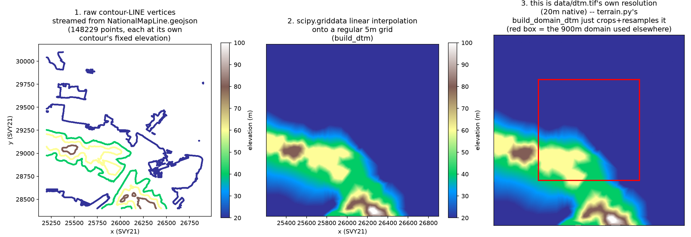
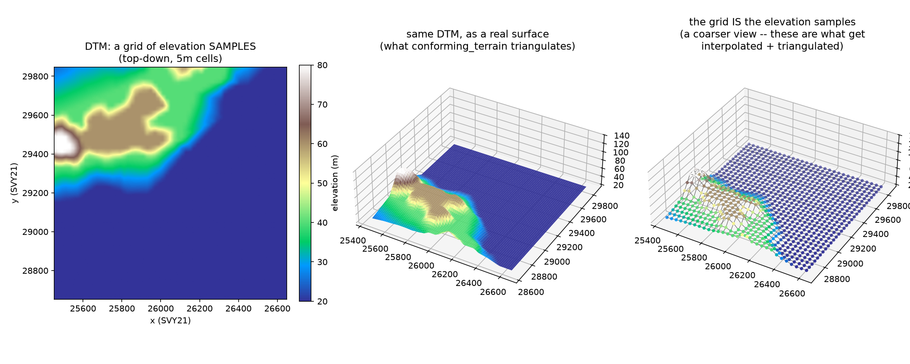
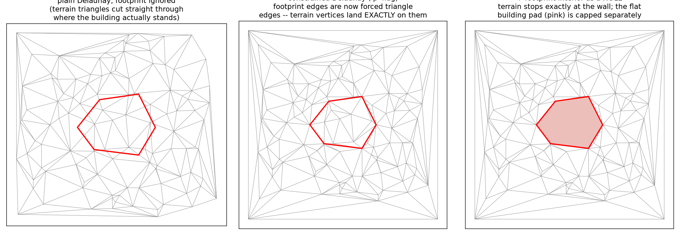

# Stage 4: terrain — `sbg/onemap_native/terrain.py`

This stage answers one question: **once a building's real mesh has been extracted and
sealed (Stage 3), where does it actually sit on the ground?** OneMap gives every
building's base a flat `z = 0` — there is no per-building ground elevation in the source
data at all. `terrain.py` builds a real terrain surface from SLA's contour data, decides
each building's ground level from it, and produces the terrain mesh the fused STL is
built from. Both images in this folder (`dtm_concept.png`,
`constrained_delaunay_concept.png`) were generated this session — the first from a real
production domain, the second a small synthetic illustration of the real algorithm
(`triangle`, the same library and the same call pattern `conforming_terrain` actually
uses).

## Chapter 0: where `data/dtm.tif` itself comes from — `NationalMapLine.geojson` → contour points → a DTM

Before `terrain.py` can crop anything, the whole-island DTM (`data/dtm.tif`) has to exist
in the first place. It's built once, offline, by two small modules
(`sbg/topo/contours.py` then `sbg/topo/dtm.py`) — not part of `terrain.py` itself, but
worth showing since everything above depends on it.

`NationalMapLine.geojson` is SLA's general-purpose map-line dataset — it's not
elevation-specific at all. It mixes several unrelated line layers (roads, expressways, a
maritime boundary, contour lines) into one file, distinguished only by a `FOLDERPATH`
property on each feature. `sbg/topo/contours.py` streams through it (`ijson`, since the
file is 634MB — too big to load whole) and keeps only the features tagged
`"Layers/Contour_250K"`, treating each one's `NAME` property as its elevation in metres
(the actual encoding SLA uses: a contour line at real elevation 40m literally has the
string `"40"` as its name — there's no separate numeric elevation field at all). Every
vertex along a kept line becomes one `(x, y, elevation)` sample, reprojected from the
source WGS84 lon/lat to this project's working EPSG:3414 metres:

```
iter_elevation_points(geojson_path):
    for each feature in the file (streamed, not loaded whole):
        if feature.properties.FOLDERPATH != "Layers/Contour_250K":
            skip it -- it's a road, not a contour
        elevation = float(feature.properties.NAME)   # e.g. "40" -> 40.0m
        for each (lon, lat) vertex along this feature's line(s):
            yield (reproject(lon, lat) -> x, y in EPSG:3414, elevation)
```

`sbg/topo/dtm.py::build_dtm()` then takes that whole scattered point cloud and
interpolates it onto a regular grid (`scipy.interpolate.griddata`, linear, with a
nearest-neighbour fallback for any cell outside the convex hull of the input points) —
this is the actual step that turns "a pile of elevation points along some lines" into "a
DTM."



Real data, same Queenstown-area window used throughout this README. **Panel 1**: 148,229
raw contour-line vertices in this window, streamed straight from
`NationalMapLine.geojson`, coloured by elevation — note they only ever take 5 exact
values here (20, 40, 60, 80, 100m): each line is a single contour at one fixed elevation,
and SLA's 1:250,000-scale source data uses a 20m contour interval, so that's *all* the
distinct elevation values that exist anywhere in this source. **Panel 2**: the same points
after `build_dtm()`'s `griddata` interpolation onto a regular 5m grid — the discrete bands
become a smooth, continuous surface, but it's a genuinely *interpolated* guess between
real contour lines, not a denser measurement (there is no way to recover real elevation
detail between two 20m contour lines from this source — the true ground could do anything
in between, this is just the smoothest guess). **Panel 3**: this whole 3.6km² window is a
small crop of the actual island-wide `data/dtm.tif` (20m native resolution, built once by
this same `build_dtm()` call over the *whole* island's contour points and written to disk
via `write_geotiff()`) — the red box marks the same 900m domain `dtm_concept.png` above
zooms into. `terrain.py::build_domain_dtm()` never re-runs this interpolation per domain;
it just opens this cached file, reads the small window it needs, and resamples that to
whatever step size the caller asked for (5m by default) — which is the ~3.5s-per-domain
interpolation cost this project measured and specifically cached away.

## What a DTM actually is

"DTM" (Digital Terrain Model) sounds like it might be some clever representation of the
ground — it's simpler than that: it's just **a grid of elevation numbers**, one per cell,
built once for a whole domain by sampling/interpolating SLA's sparse 20m contour-line
data onto a regular grid. Nothing about "terrain" is special here — it's the same kind of
2D array you'd use for a grayscale image, except each cell stores a height in metres
instead of a brightness.



This is a real 900m×900m domain (Queenstown area, `build_domain_dtm((25600, 28800, 26500,
29700), step=5.0)`), genuinely ranging 20–80m in elevation. Left: the raw grid, viewed
from above, coloured by height — this is the actual data structure (`grid_z`, a 2D numpy
array, plus an `affine` transform that says where cell `(0,0)` sits in real EPSG:3414
coordinates and how big each cell is). Middle: the same grid drawn as a 3D surface — this
is what a person means by "terrain," but it's derived by just connecting each grid cell's
4 neighbours into two triangles (`terrain_surface_mesh`, or, on the actual conforming
path, `conforming_terrain`'s triangulation — see below). Right: the same thing at a
coarser sample spacing, to make it visually obvious that **the grid cells are the entire
terrain** — there is no hidden finer truth underneath; anywhere the real ground varies
faster than the grid spacing, that detail simply isn't there.

`build_domain_dtm()` doesn't interpolate from scratch every time — it crops and
bilinearly resamples a pre-built whole-island 20m cache (`data/dtm.tif`) instead, which
is why it takes milliseconds instead of the ~3.5s a fresh `scipy.griddata` interpolation
over raw contour points would cost. In plain terms:

```
build_domain_dtm(domain_bbox, step):
    if the whole-island cache exists:
        read just the small window covering domain_bbox (+ a margin) out of it
        resample that window onto a regular grid at `step` metres/cell (bilinear)
    else:
        load raw SLA contour points inside domain_bbox
        interpolate them onto a `step`-metre grid (scipy.griddata)
    return (grid_of_heights, affine_transform)
```

Reading a height back out at an arbitrary (x, y) — not just at grid points — is
`DtmSampler`, plain bilinear interpolation:

```
DtmSampler(x, y):
    convert (x, y) to fractional (row, col) via the inverse affine transform
    look up the 4 surrounding grid cells
    blend them by how close (x, y) is to each corner (bilinear weights)
    return the blended height
```

This sampler is called constantly downstream — every building's pad elevation, every
terrain triangle's height at a non-grid point, all go through it.

## Why a building's ground level isn't just "the DTM height under it"

The docstring at the top of `terrain.py` states the real reason plainly: the DTM is
built from `scipy.griddata`-interpolated **sparse** 20m contour points, so it's made of
flat triangular facets whose *creases* create small, spurious local dips that don't
correspond to anything real on the ground. Naively taking the *minimum* DTM height under
a building's footprint chases exactly one of those dips and sinks the whole building into
a pit relative to its real surroundings — reported once as buildings looking "sunk on all
four sides." The fix actually used is a **25th-percentile**, not the minimum: robust to
one bad dip, while still sitting the pad near the real low side of the footprint rather
than an optimistic high point.

```
pad_z(footprint) = 25th percentile of { DTM(x, y) for (x, y) in footprint }
```

Buildings that are physically connected (a bridge, a shared podium, two towers over one
basement) need to agree on *one* pad level or the join tears — `terrain.py` groups
touching footprints into "compounds" and, by default (`mode="drape"`), simply gives every
piece its own capped ground level; two other modes (`"group"`: physically-linked pieces
forced to one shared level; `"laplacian"`: a soft, least-squares compromise between the
two) exist for the cases where "everyone drapes independently" visibly shears a real
bridge apart. There's real, measured evidence in the file that **no single threshold
between these can be right for every case** — two real building clusters in this
project's own test domains happen to have the *exact same* 20.0m of ground spread and
need opposite treatment (one is genuinely one bridge-linked structure, the other is a
string of separate blocks stepping up a hillside) — so this is documented as a genuine,
unresolved modelling choice, not a bug waiting for the right tuning constant.

## The constrained Delaunay triangulation — why footprints are triangulation *constraints*, not just data

A plain Delaunay triangulation of a scattered set of terrain sample points doesn't know or
care that a building sits among them — its triangles are free to cut straight through
where a real wall stands, so the terrain and the building meet at an approximate,
slightly-off seam rather than a shared edge. `conforming_terrain()` fixes this the
standard way any terrain-with-buildings problem is solved: **insert every building
footprint ring as an edge constraint** in the triangulation (`triangle`, Shewchuk's CDT
library, the `'p'` flag). This forces the triangulation to keep those exact edges,
so a terrain vertex ends up sitting *exactly* on the footprint boundary — not
merely close to it.



A small synthetic example (not real building data — just illustrating the mechanism with
the same library call): **left**, an ordinary unconstrained Delaunay triangulation of 110
scattered points, with a hexagonal footprint drawn on top purely for reference — the
triangulation has no idea it's there, and several triangle edges cross straight through
it. **Middle**, the exact same point set, but the hexagon's 6 edges are now fed in as
triangulation constraints — the triangulation reshapes itself so every one of those edges
is a real triangle edge, with terrain vertices landing precisely on the footprint corners.
**Right**, one step further: the footprint's interior is marked as a `hole` (`triangle`'s
`holes` parameter — a single point known to be inside the region to exclude), so nothing
gets triangulated *inside* the building at all; that flat area (pink) is capped separately
as the building's pad, at its own `pad_z`.

```
conforming_terrain(domain_polygon, dtm, building_pad_polygons):
    background_points = a regular grid of points inside domain_polygon,
                        skipping anywhere already covered by a building pad
    constraint_segments = the edges of:
        - the domain's own outer boundary (so the terrain has a clean edge to clip to)
        - every building pad polygon's boundary
    every point going in gets a height:
        - background points -> DTM(x, y)
        - domain-boundary points -> DTM(x, y)
        - building-pad-boundary points -> that pad's fixed pad_z (flat)
    triangulate(all_points, constraint_segments, mode='p')   # CDT, Shewchuk's `triangle`
    return the resulting (vertices, triangles), now in 3D (x, y, height)
```

Two real, non-obvious details baked into the real function, both found from actual bugs
rather than anticipated in advance:

- **The domain's own boundary ring is densified before being fed in as constraints**
  (`_densify_ring`, splitting every edge so no segment exceeds `terrain_step`). `triangle`'s
  `'Y'` flag (used here to forbid it from inventing extra points *inside* a constrained
  segment) means a boundary given as just 4 bare corners is forced to interpolate
  *linearly* between them — on one real domain this put the terrain's own boundary wall up
  to 36m off the true elevation profile between two corners. Densifying supplies the
  missing in-between points ourselves.
- **`triangle` needs coordinates shifted near the origin first.** At real EPSG:3414
  magnitudes (~30,000m), `triangle.triangulate()` was found to silently return zero
  triangles — no error, just nothing. Shifting all input points by `-min(vertices)`
  before triangulating (and shifting the result back afterward) fixes it; this is the
  same fix the older v1 CityJSON pipeline's own conforming-mesh code already needed.

## From a flat terrain sheet to a real solid: `terrain_flat_base_solid`

A CDT triangulation is a *sheet* — one height per (x, y), no thickness. Fusing it with
building geometry (Stage 5) needs a real, closed **solid**. `terrain_flat_base_solid`
extrudes the terrain sheet straight down to one flat plane:

```
terrain_flat_base_solid(terrain_surface, domain_polygon, base_z):
    for every point on the terrain's own outer boundary (already exactly matching a
    real terrain vertex, by construction, from the CDT step above):
        add a matching point directly below it, at a fixed height base_z
    wall = a quad strip connecting each boundary edge on top to its mirror below
    bottom_cap = a flat triangulated cap at base_z (earcut, so a non-convex domain
                shape doesn't get filled in wrong -- see Stage 3's own earcut-vs-fan note)
    return terrain_surface + wall + bottom_cap    # now a genuine closed solid
```

`base_z` isn't hardcoded to 0 — a building's plunge skirt (next section) can reach up to
30m below its own pad, which on low-lying ground can go negative; the real caller derives
`base_z` from the lowest point in the actual scene so nothing pokes through this solid's
own sealed floor.

## Sitting a building down: pads and skirts

Once a building has a `pad_z`, two things happen (`place_on_terrain_conforming`,
`_skirt`):

```
for each building piece:
    shift every vertex up/down so the piece's own base sits exactly at pad_z
    build a downward "skirt": a closed prism that follows the footprint's own
    outline (earcut-capped top and bottom, not a fan -- a fan wrongly fills in
    any concave notch in the footprint) and plunges PLUNGE_M (30m) below pad_z
```

The skirt exists purely so the building's geometry genuinely *overlaps* the terrain
slab's volume — without real overlap, the whole-scene voxel remesh (Stage 5) has nothing
to fuse the two surfaces on, and they stay two separate, ungrounded objects. Skirt depth
(30m) is deliberately less than the terrain slab's own thickness (`SOLIDIFY_M = 60m`) so
a building never plunges all the way through the slab's own floor.

## Numbers worth keeping in mind

- Default terrain grid step: 5m (island DTM cache itself is natively 20m — below roughly
  that scale, the terrain genuinely carries no more real information, no matter how fine
  a step is requested downstream).
- Pad level: 25th percentile of DTM under a footprint (not min, not mean).
- Skirt plunge depth: 30m; terrain slab thickness: 60m.
- Two footprints/pieces are treated as one physically-connected structure (and must share
  a pad level in `"group"`/`"laplacian"` mode) if their real 3D surfaces come within 0.5m
  of each other — measured by exact point-to-triangle distance, *not* vertex-to-vertex
  (these meshes' triangles can be 7–12m on a side, so two genuinely touching surfaces can
  have their nearest *vertices* several metres apart — a real, previously-shipped bug).

## Files in this folder

- `contour_to_dtm.png` / `render_contour_to_dtm.py` — real `NationalMapLine.geojson`
  contour points → `griddata` interpolation → the cached `data/dtm.tif`, chapter 0 above.
- `dtm_concept.png` / `render_dtm_concept.py` — the real 900m Queenstown-area DTM shown
  three ways, generated straight from `sbg.onemap_native.terrain.build_domain_dtm()`.
- `constrained_delaunay_concept.png` / `render_constrained_delaunay_concept.py` — the
  synthetic (not real building data) 3-panel illustration of why footprint edges are fed
  into `triangle.triangulate()` as constraints, using the same library and the same `'p'`
  call pattern `conforming_terrain()` actually uses.

